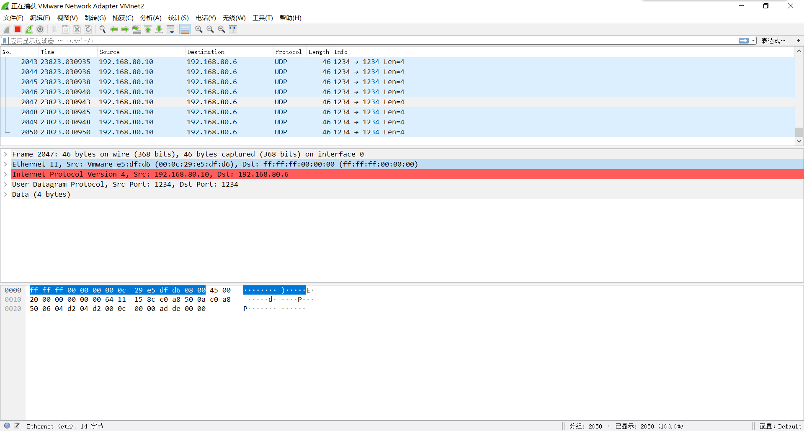

# Distributed systems lab2
#### 515015910005 丁丁 dingd2015@sjtu.edu.cn

## part 1
***Q1: What’s the purpose of using hugepage?***

如果采用常规页（4KB）并且使TLB总能命中，则需要在TLB表中存放2个表项（在三段查表的情况下）。由于TLB的大小是有限的，随着程序变大或者程序使用内存的增加，TLB的使用项也会增加，最后导致TLB不明中的情况。在使用大页的情况下，只需要1个表项即可保证不出现TLB不命中。所以采用大页可以大大减少TLB miss。

***Q2: Take examples/helloworld as an example, describe the execution flow of DPDK programs?***

进入main函数后，首先调用rte_eal_init启动基础运行环境。rte_eal_init读取入口参数，解析并保存作为DPDK运行的系统信息，依赖这些信息构建一个针对包处理设计的运行环境。

RTE_LCORE_FOREACH_SLAVE(lcore_id)遍历所有EAL指定可以使用的lcore，然后通过rte_eal_remote_launch在每个lcore上，启动被指定的线程。

rte_eal_remote_launch(lcore_hello, NULL, lcore_id)函数中，lcore_id指定了从线程ID，运行入口函数lcore_hello。

在函数lcore_hello中，它读取自己的逻辑核编号lcore_id，printf("hello from core %u\n", lcore_id)进行打印。

***Q3: Read the codes of examples/skeleton, describe DPDK APIs related to sending and
receiving packets.***

| API | 作用 |
| ------ | ------ |
| port_init(uint8_t port, struct rte_mempool *mbuf_pool) | 网口初始化 |
| int rte_eth_dev_configure(uint8_t port_id, uint16_t nb_rx_q, uint16_t nb_tx_q, const struct rte_eth_conf *dev_conf)| 网口设置 |
| int rte_eth_rx_queue_setup(uint8_t port_id, uint16_t rx_queue_id, uint16_t nb_rx_desc, unsigned int socket_id, const struct rte_eth_rxconf *rx_conf, struct rte_mempool *mp) | 队列初始化|
|int rte_eth_tx_queue_setup(uint8_t port_id, uint16_t tx_queue_id, uint16_t nb_tx_desc, unsigned int socket_id, const struct rte_eth_txconf *tx_conf) | 队列初始化|
|int rte_eth_dev_start(uint8_t port_id)| 启动端口|
|static inline uint16_t rte_eth_rx_burst(uint8_t port_id, uint16_t queue_id, struct rte_mbuf **rx_pkts, const uint16_t nb_pkts)| 收取报文 |
|static inline uint16_t rte_eth_tx_burst(uint8_t port_id, uint16_t queue_id, struct rte_mbuf **tx_pkts, uint16_t nb_pkts)| 发送报文|

***Q4: Describe the data structure of ‘rte_mbuf’.***

rte_mbuf中包含三个部分：HEADROOM，DATA和TAILROOM。其中HEADROOM主要用于存放一些描述信息，同TAILROOM一同方便解封装操作。DATA部分存放报文数据。当报文较大的时候会将数据存在多个mbuf里，通过链表连接起来。

## part 2
***代码实现***

part2中实现了一个简单的发包逻辑，可以通过修改代码中的宏来快速更改发包的地址、数量等。每个包的数据部分为一个int，内容为0xdead。

宏定义如下：
| 宏 | 含义 |
|--- |-----|
|PACKAGES| 总共发多少个包|
|DSTMAC|目标mac地址|
|SRCIP|发送端IP地址|
|DSTIP|接收端IP地址|
|SRCPORT|发送端端口号|
|DSTIP|接收端端口号|

使用Wireshark抓取包的结果如下：

经比对发现，抓取包的内容和代码所设置内容（包括但不限于发送端、接受端IP、端口，发送数据等）均相符，可判断发送正确。

